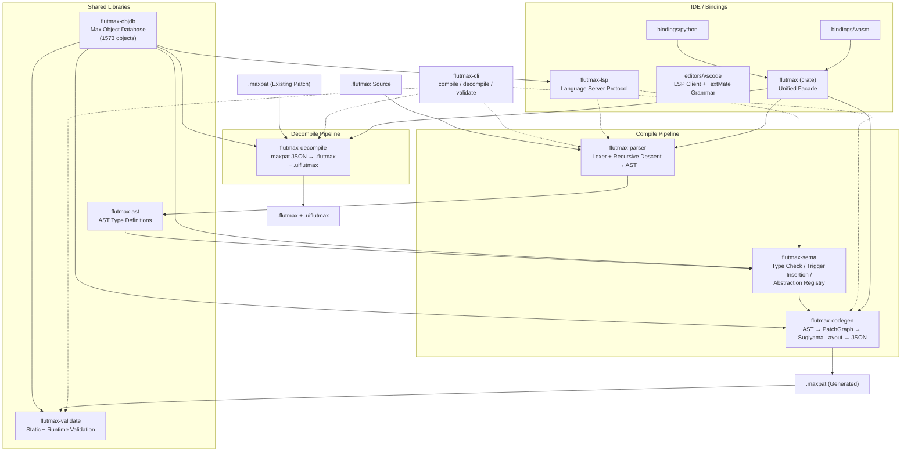
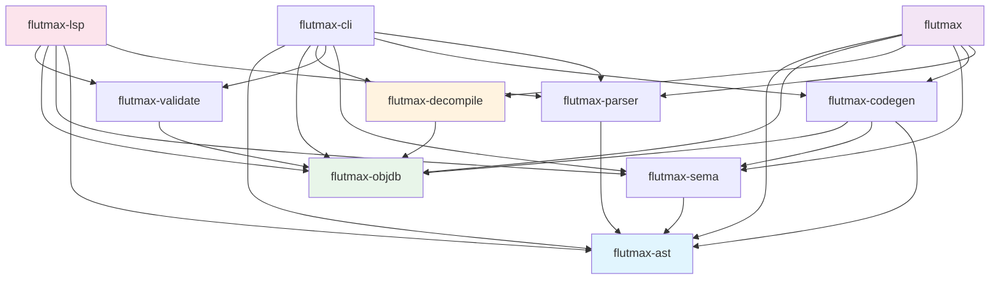
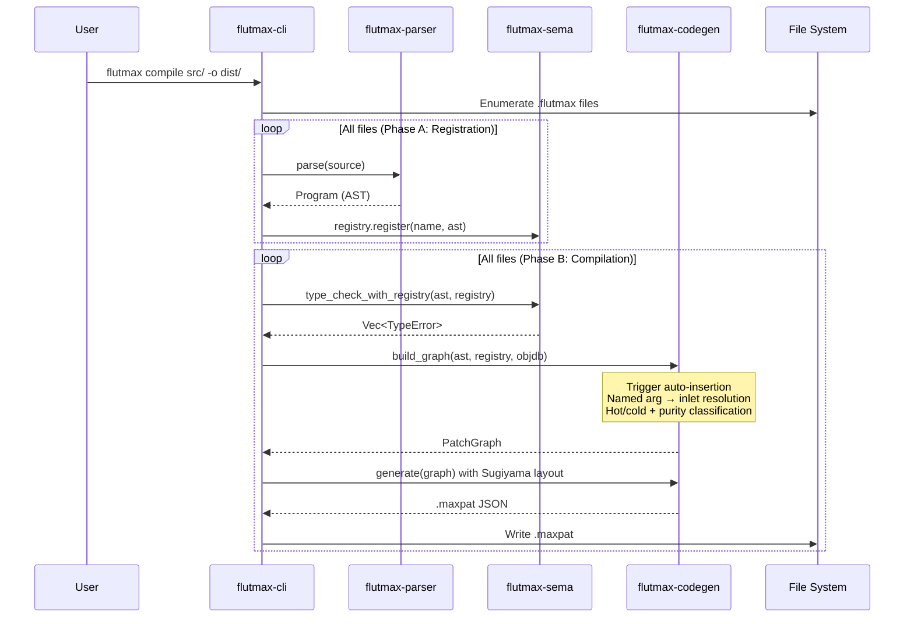
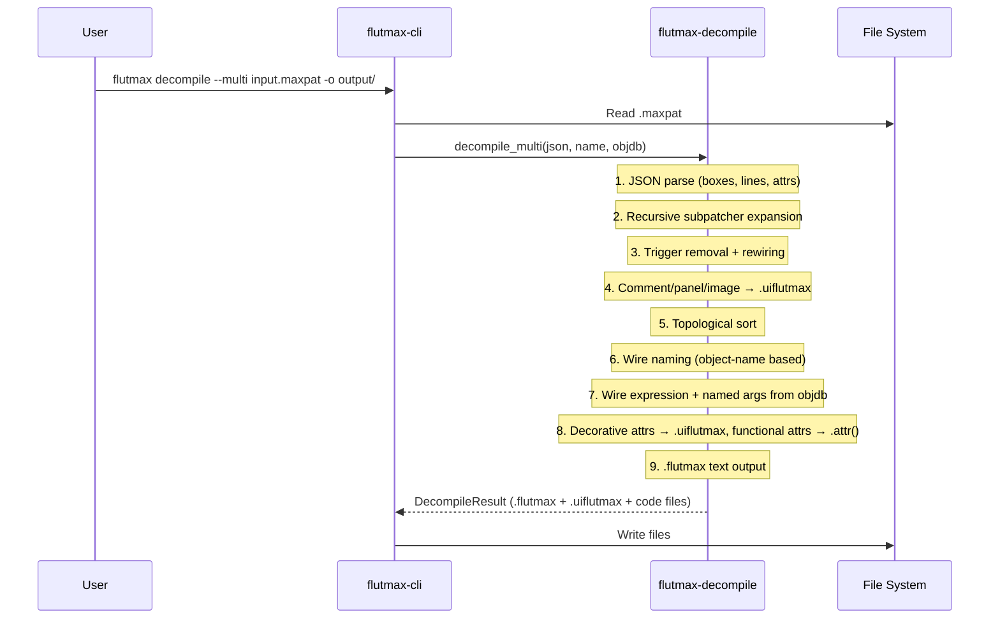
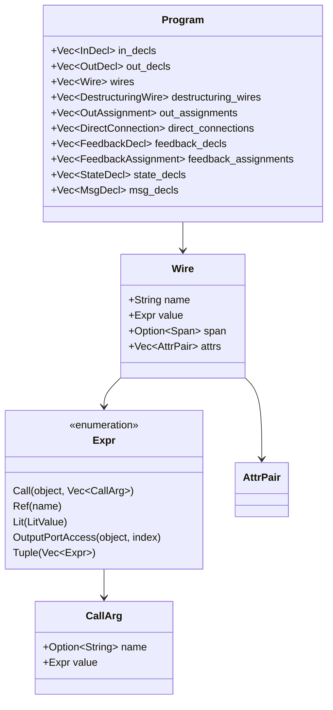
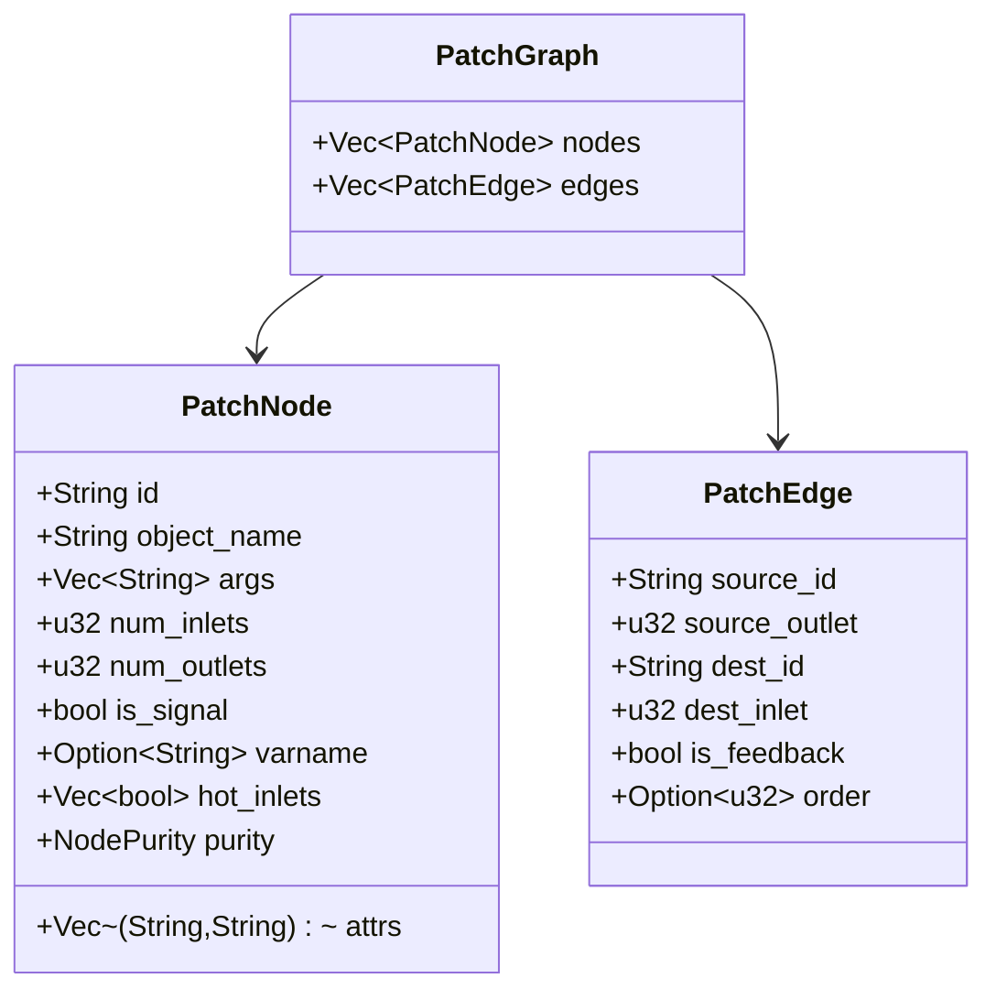

# flutmax Architecture

- **Updated**: 2026-04-05

## Overview

flutmax is a transpiler for writing Max/MSP patch files (`.maxpat`) as structured text (`.flutmax`). It is implemented as a Rust workspace of 10 crates, providing bidirectional conversion: compile (`.flutmax` to `.maxpat`) and decompile (`.maxpat` to `.flutmax` + `.uiflutmax`).

### Design Principles

- **Bidirectional Fidelity**: Semantic information is preserved through decompile → compile roundtrips (verified at 100% across 1282 patches)
- **Deterministic Execution Order**: Replaces Max's coordinate-dependent execution order with code order (top to bottom), automatically inserting `trigger` objects
- **Type Safety**: Signal / Control connection mismatches detected at compile time. Control is further subdivided into Int / Float / Symbol / Bang / List
- **Git Friendliness**: Text-based with clear diffs. Flat structure where 1 file = 1 Abstraction. Visual attributes separated into `.uiflutmax` sidecar

## High-Level Overview



## Crate Dependency Graph



## Crate Overview

### Compile Pipeline

| Crate | Role | Input | Output |
|-------|------|-------|--------|
| **flutmax-parser** | Lexer + recursive descent parser (pure Rust) | Source string | `Program` (AST) |
| **flutmax-sema** | Type checking (Signal/Control), trigger insertion, Abstraction registry | AST + Registry | Type errors / PatchGraph extensions |
| **flutmax-codegen** | AST → PatchGraph → .maxpat JSON with Sugiyama graph layout | AST + Registry + ObjDb | .maxpat JSON string |

### Decompile Pipeline

| Crate | Role | Input | Output |
|-------|------|-------|--------|
| **flutmax-decompile** | Analyze .maxpat, remove triggers, name wires, separate UI | .maxpat JSON + ObjDb | .flutmax source + .uiflutmax sidecar |

### Shared Libraries

| Crate | Role |
|-------|------|
| **flutmax-ast** | AST type definitions (`Program`, `Wire`, `Expr`, `CallArg`, `Span`, etc.) |
| **flutmax-objdb** | Max object database from `refpages/*.maxref.xml` — 1573 objects with inlet/outlet count, types, Hot/Cold, descriptions |
| **flutmax-validate** | Static .maxpat validation (JSON structure + objdb checks) and optional Max runtime validation via Node for Max UDP |

### Entry Points

| Crate | Role |
|-------|------|
| **flutmax-cli** | CLI with `compile` / `decompile` / `validate` subcommands |
| **flutmax-lsp** | Language Server Protocol — diagnostics, completion (1573 objects), hover (inlet details), go-to-definition, semantic tokens, signature help |
| **flutmax** | Unified facade crate — `compile()`, `decompile()`, `parse_to_json()` for library use |

### Bindings

| Binding | Technology | API |
|---------|-----------|-----|
| **bindings/python** | PyO3 / maturin | `flutmax_py.compile()`, `.decompile()`, `.parse()` |
| **bindings/wasm** | wasm-bindgen / wasm-pack | `compile()`, `decompile()`, `parse()` |

### External Components

| Component | Language | Role |
|-----------|----------|------|
| **tree-sitter-flutmax** | JavaScript (grammar.js) → C (parser.c) | Grammar definition for VS Code syntax highlighting only |
| **editors/vscode** | TypeScript | VS Code extension — LSP client, TextMate grammar, snippets |
| **scripts/max-validator** | JavaScript (v8.codebox + Node for Max) | Runtime validation server inside Max (UDP 7401/7402) |

## Compile Pipeline



## Decompile Pipeline



## AST Structure



## PatchGraph (IR)



## Directory Structure

```
flutmax/
├── Cargo.toml                    # Workspace root
├── README.md                     # Project overview
├── SYNTAX.md                     # Language syntax specification
├── ARCHITECTURE.md               # This document
├── LICENSE                       # MIT
│
├── crates/
│   ├── flutmax/                  # Unified facade crate (compile, decompile, parse_to_json)
│   ├── flutmax-ast/              # AST type definitions (Expr, Wire, Program, Span, CallArg)
│   ├── flutmax-parser/           # Hand-written Pure Rust lexer + recursive descent parser
│   ├── flutmax-sema/             # Semantic analysis (type check, trigger insertion, registry)
│   ├── flutmax-codegen/          # AST → PatchGraph → .maxpat JSON (Sugiyama layout)
│   ├── flutmax-objdb/            # Max object database (1573 objects from refpages)
│   ├── flutmax-validate/         # Static validation + Node for Max runtime validation
│   ├── flutmax-decompile/        # .maxpat → .flutmax + .uiflutmax decompiler
│   ├── flutmax-lsp/              # Language Server Protocol (diagnostics, completion, hover, go-to-def)
│   └── flutmax-cli/              # CLI entry point (compile / decompile / validate)
│
├── bindings/
│   ├── python/                   # Python bindings (PyO3 / maturin)
│   └── wasm/                     # WebAssembly bindings (wasm-bindgen / wasm-pack)
│
├── editors/
│   └── vscode/                   # VS Code extension (syntax, snippets, LSP client)
│
├── tree-sitter-flutmax/          # Tree-sitter grammar (VS Code syntax highlighting)
│
├── examples/
│   └── synths/                   # Synthesizer examples (FM, subtractive, delay, granular)
│
├── scripts/
│   └── max-validator/            # Max runtime validator (v8.codebox + Node for Max UDP)
│
└── tests/
    └── e2e/                      # End-to-end test fixtures and expected outputs
```

## Test Suite

| Category | Count | Description |
|----------|-------|-------------|
| Rust unit/integration tests | 915+ | Tests across all crates |
| VS Code extension tests | 86 | Grammar, snippets, language-config, package |
| Tree-sitter corpus tests | ~70 | Parser syntax tests |
| Max roundtrip tests | 1282 | Max.app patch decompile → compile → compare (100% PASS) |
| **Total** | **~2353** | |
